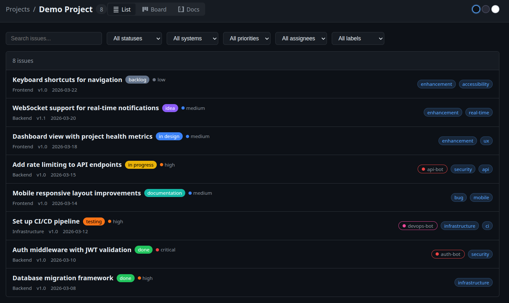
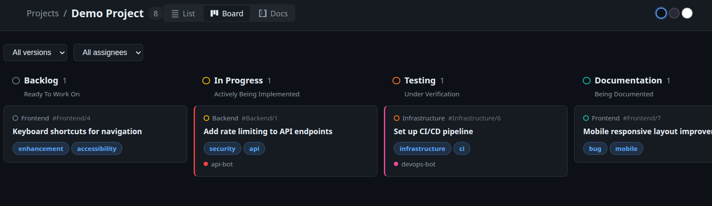
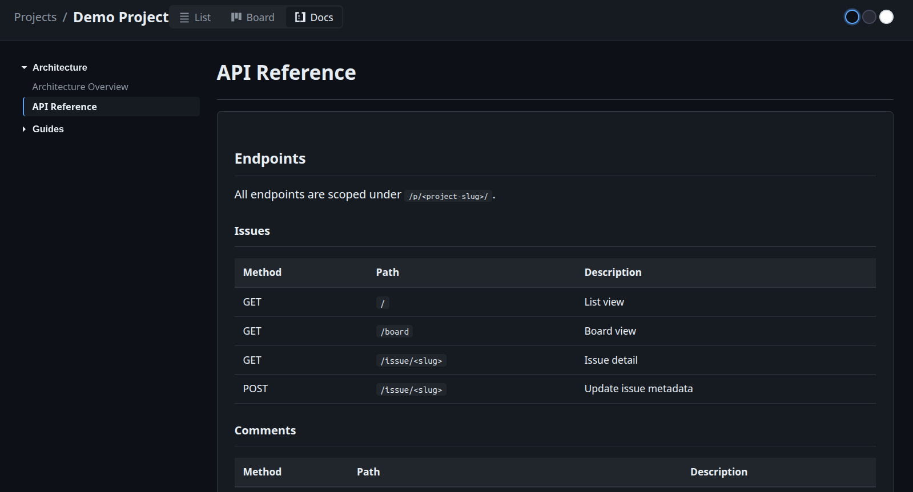

# AI-Native Project Viewer

A self-hosted project tracker that reads markdown files. Kanban board, docs viewer, inline comments — all from plain `.md` files on disk.

## Why?

AI coding agents (Claude, Copilot, Cursor) work with files. They read them, write them, grep them. That's it. Every API call to GitHub Issues, Jira, or Linear is wasted tokens, authentication overhead, and fragile integration code.

Plain markdown files on disk are the fastest, simplest interface for AI agents to manage project work. An agent can create an issue with `echo`, update status with `sed`, search with `grep`, and read context with `cat`. No API keys, no rate limits, no SDKs.

This viewer gives you the human-friendly UI on top — kanban board, filters, inline editing — while keeping the data in the format that agents already understand: files.

  

## Demo

```bash
make demo
```

Open `http://localhost:8080` to see a sample project with issues and docs.

## Features

- **List view** with filters (status, system, priority, labels, assignee, search)
- **Kanban board** with drag-and-drop to change status, version/assignee filters
- **Documentation** viewer with folder tree sidebar
- **Multi-project** support via `projects.yaml`
- **Inline editing** — change status, priority, version, labels, assignee, and body from the UI
- **Inline comments** on issue body blocks with open/done status
- **Issue references** — `#123` auto-links to other issues
- **Theme picker** — dark, dracula, light
- **GitHub sync** script to import from GitHub Projects

## Quick Start

```bash
go build
./issue-viewer -dir ./my-issues -docs ./my-docs
```

Open `http://localhost:8080`.

## Multi-Project Mode

Create a `projects.yaml` (see `projects.yaml.example`):

```yaml
projects:

  - name: "My Project"
    slug: "my-project"
    issues: "./project-a/issues"
    docs: "./project-a/docs"

  - name: "Another"
    slug: "another"
    issues: "/absolute/path/to/issues"
    docs: "/absolute/path/to/docs"
```

```bash
./issue-viewer -config projects.yaml
```

## Issue Format

Markdown files with YAML frontmatter in the issues directory (supports subdirectories):

```markdown
---
title: "Fix heat calculation"
status: "in progress"
system: "Combat"
version: "0.1"
assignee: "expedition_designer"
priority: "high"
labels:

  - bug
  - combat
---

Description in markdown. Supports tables, checkboxes, and `#123` issue references.
```

### Fields

| Field      | Required | Description                                     |
|:-----------|:---------|:------------------------------------------------|
| `title`    | Yes      | Issue title                                     |
| `status`   | No       | Workflow stage (see below)                      |
| `system`   | No       | Category tag, also used as subdirectory name    |
| `version`  | No       | Version string, filterable on the board         |
| `assignee` | No       | Who is working on it                            |
| `priority` | No       | `low`, `medium`, `high`, or `critical`          |
| `labels`   | No       | List of label strings                           |
| `created`  | No       | Date string for sorting                         |

### Statuses

`idea` → `in design` → `backlog` → `in progress` → `testing` → `documentation` → `done`

## Documentation Pages

Markdown files in the docs directory (supports subdirectories as sections):

```markdown
---
title: "Page Title"
order: 1
---

Content here.
```

Frontmatter is optional. Title defaults to the filename. `order` controls sort position.

## Syncing from GitHub Projects

```bash
./sync-issues.sh <owner> <project-number> [output-dir]
./sync-issues.sh my-username 4 ./issues
```

Downloads all items from a GitHub Project and writes them as `issues/<System>/<number>.md`.

## CLI Flags

| Flag       | Default      | Description                                |
|:-----------|:-------------|:-------------------------------------------|
| `-config`  | —            | Path to `projects.yaml` (multi-project)    |
| `-dir`     | `./issues`   | Issues directory (single-project mode)     |
| `-docs`    | `./docs`     | Docs directory (single-project mode)       |
| `-port`    | `8080`       | HTTP port                                  |

## Inline Comments

Comments are stored at the bottom of issue files in an HTML comment block (invisible to other markdown renderers):

```html
<!-- issue-viewer-comments
{"id":1,"block":0,"date":"2026-03-28","text":"Needs more detail","status":"open","source":"app"}
-->
```

## API

| Method | Path                                      | Description          |
|:-------|:------------------------------------------|:---------------------|
| POST   | `/p/<project>/issue/<slug>`               | Update frontmatter   |
| GET    | `/p/<project>/issue/<slug>/comments`      | List comments        |
| POST   | `/p/<project>/issue/<slug>/comments`      | Add comment          |
| POST   | `/p/<project>/issue/<slug>/comments/toggle` | Toggle comment done |
| POST   | `/p/<project>/issue/<slug>/comments/delete` | Delete comment      |
